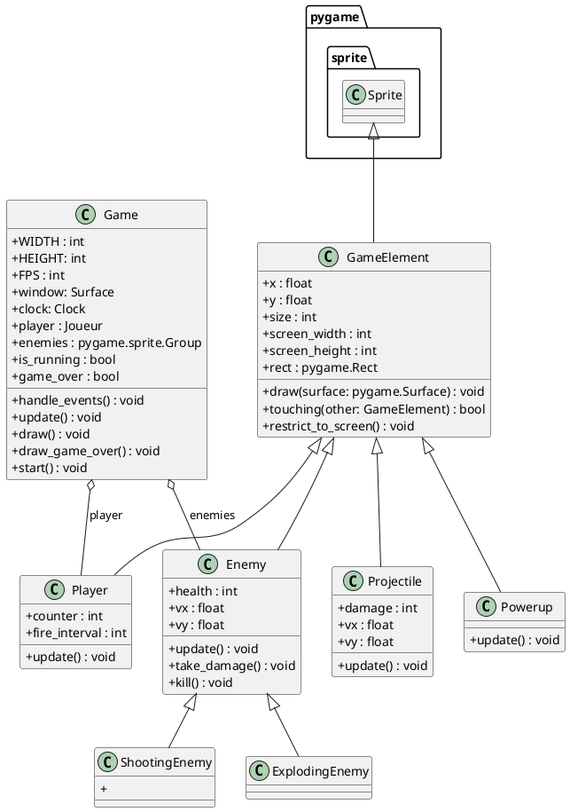

```plantuml
@startuml
skinparam classAttributeIconSize 0
skinparam classStyle rectangle

class GameElement {
    + x : float
    + y : float
    + size : int
    + screen_width : int
    + screen_height : int
    + rect : pygame.Rect
    + draw(surface: pygame.Surface) : void
    + touching(other: GameElement) : bool
    + restrict_to_screen() : void
}

class Player {
    + counter : int
    + fire_interval : int
    + update() : void
}

class Enemy {
    + health : int
    + vx : float
    + vy : float
    + update() : void
    + take_damage() : void
    + kill() : void
}

class ShootingEnemy {
    + 
}

class ExplodingEnemy {

}

class Projectile {
    + damage : int
    + vx : float
    + vy : float
    + update() : void
}

class Powerup {
    + update() : void
}


class Game {
    + WIDTH : int
    + HEIGHT: int
    + FPS : int
    + window: Surface
    + clock: Clock
    + player : Joueur
    + enemies : pygame.sprite.Group
    + is_running : bool
    + game_over : bool
    + handle_events() : void
    + update() : void
    + draw() : void
    + draw_game_over() : void
    + start() : void
}

pygame.sprite.Sprite <|-- GameElement
GameElement <|-- Player
GameElement <|-- Enemy
GameElement <|-- Projectile 
GameElement <|-- Powerup
Enemy <|-- ShootingEnemy
Enemy <|-- ExplodingEnemy
Game o-- Player : player
Game o-- Enemy : enemies
@enduml
```