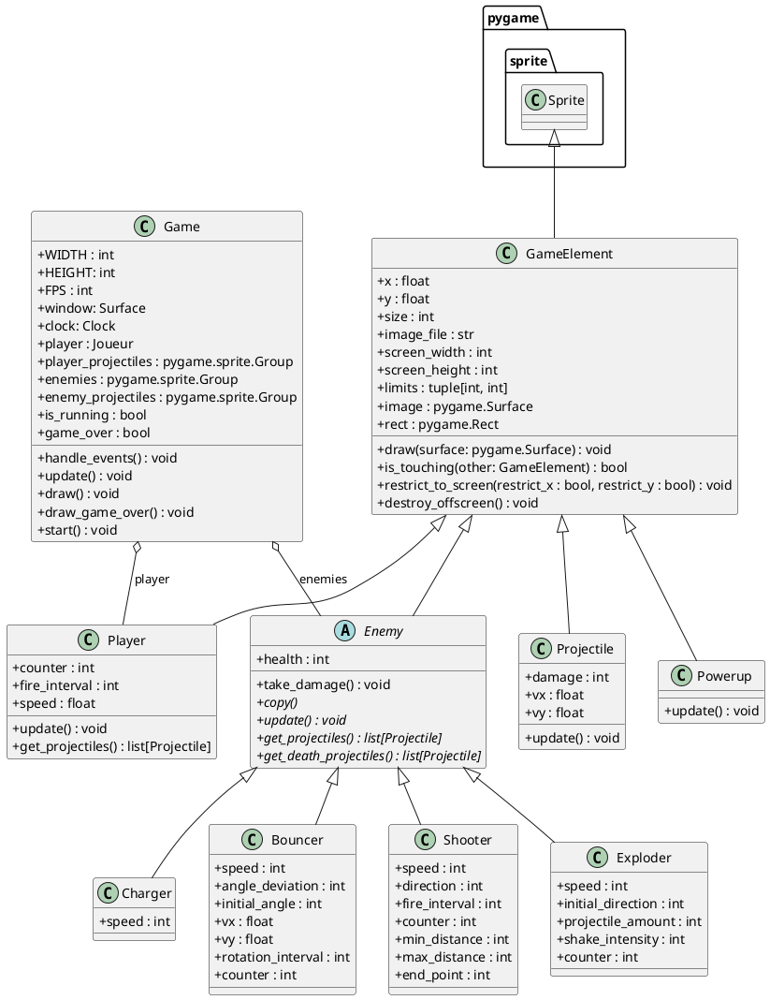

```plantuml
@startuml
skinparam classAttributeIconSize 0
skinparam classStyle rectangle

class GameElement {
    + x : float
    + y : float
    + size : int
    + image_file : str
    + screen_width : int
    + screen_height : int
    + limits : tuple[int, int]
    + image : pygame.Surface
    + rect : pygame.Rect
    + draw(surface: pygame.Surface) : void
    + is_touching(other: GameElement) : bool
    + restrict_to_screen(restrict_x : bool, restrict_y : bool) : void
    + destroy_offscreen() : void
}

class Player {
    + counter : int
    + fire_interval : int
    + speed : float
    + update() : void
    + get_projectiles() : list[Projectile]
}

abstract class Enemy {
    + health : int
    + take_damage() : void
    {abstract} + copy()
    {abstract} + update() : void
    {abstract} + get_projectiles() : list[Projectile]
    {abstract} + get_death_projectiles() : list[Projectile]   
}

class Charger {
    + speed : int
}

class Bouncer {
    + speed : int
    + angle_deviation : int
    + initial_angle : int
    + vx : float
    + vy : float
    + rotation_interval : int
    + counter : int
}

class Shooter {
    + speed : int
    + direction : int
    + fire_interval : int
    + counter : int
    + min_distance : int
    + max_distance : int
    + end_point : int
}

class Exploder {
    + speed : int
    + initial_direction : int
    + projectile_amount : int
    + shake_intensity : int
    + counter : int
}

class Projectile {
    + damage : int
    + vx : float
    + vy : float
    + update() : void
}

class Powerup {
    + update() : void
}

class Game {
    + WIDTH : int
    + HEIGHT: int
    + FPS : int
    + window: Surface
    + clock: Clock
    + player : Joueur
    + player_projectiles : pygame.sprite.Group
    + enemies : pygame.sprite.Group
    + enemy_projectiles : pygame.sprite.Group
    + is_running : bool
    + game_over : bool
    + handle_events() : void
    + update() : void
    + draw() : void
    + draw_game_over() : void
    + start() : void
}

pygame.sprite.Sprite <|-- GameElement
GameElement <|-- Player
GameElement <|-- Enemy
GameElement <|-- Projectile 
GameElement <|-- Powerup
Enemy <|-- Charger
Enemy <|-- Bouncer
Enemy <|-- Shooter
Enemy <|-- Exploder
Game o-- Player : player
Game o-- Enemy : enemies
@enduml
```